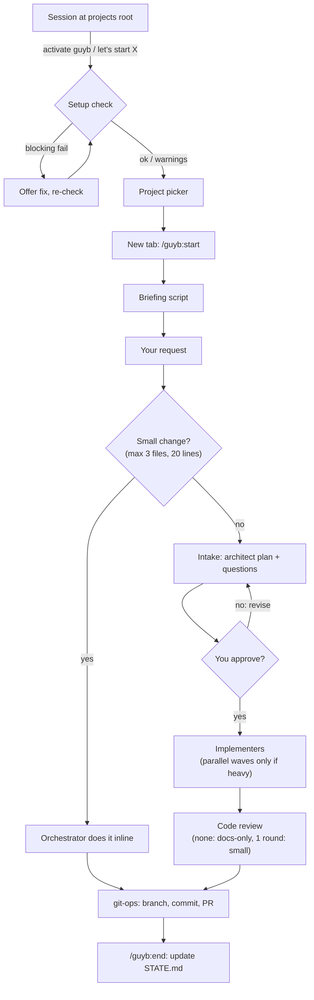

# guyb

> From *guyub* (Javanese/Indonesian): a tight, harmonious collective where members work in sync.

guyb is a Claude Code plugin: an **orchestrator playbook plus a team of 12 specialist subagents**. Every session becomes a project orchestrator that plans, delegates in the background, and reports back. **One terminal tab = one project = one orchestrator.** guyb manages where credentials live but never stores or sees their values.

## Workflow



## Install

Needs [Claude Code](https://code.claude.com/docs) v2.1.280+ and `git` (Git for Windows on Windows). Everything else (`gh`, `glab`, `aws`, `gcloud`, `az`, DB clients) is optional.

```powershell
# Windows (PowerShell 7): plugin + recommended permissions + launcher
git clone https://github.com/alamhanz/guyb.git
./guyb/scripts/install.ps1 -ProjectsRoot D:\projects
```

```bash
# macOS / Linux
git clone https://github.com/alamhanz/guyb.git
./guyb/scripts/install.sh --root ~/projects
```

Options (`-SkipPermissions` / `--skip-permissions`, `--skip-launcher`) are in the script headers; the permission rules are in [`settings/recommended-permissions.json`](settings/recommended-permissions.json) (allow read-only git/cloud, ask on destructive ops, deny reading `.env` and key files).

**Plugin only:**

```
claude plugin marketplace add alamhanz/guyb
claude plugin install guyb@guyb
```

Then run `/guyb:setup` once in any project: it detects installed CLIs and logins, installs what you choose (asking first), and records a no-secrets profile in `~/.claude/guyb/profile.md`.

## Usage

guyb is built and tested for the terminal (Windows Terminal, or tmux on macOS/Linux). Claude Desktop and Cowork are untested.

**From the projects root.** Start `claude` in the folder that holds your projects and say "activate guyb" or "let's start myapp". That session is a launcher (`/guyb:launch`): it runs the setup check, shows a picker (skipped if you named a project), and opens the project in a new tab running `/guyb:start`. Or use the shell launcher directly:

```
guyb              # pick from GUYB_ROOT
guyb myapp        # open GUYB_ROOT/myapp in a new tab
```

Launcher flags and the `-List` / `--list` output format are documented in the headers of `scripts/launch.ps1` and `scripts/launch.sh`; the check JSON is described in `plugins/guyb/skills/launch/SKILL.md`.

**In a project.** `/guyb:start` gives a briefing (branch, open PRs, next steps from `.claude/STATE.md`), drafts `.claude/CLAUDE.md` on first use, and asks what to work on. Then just talk: "add rate limiting to the API and ship it". Non-trivial work shows a plan and questions first; you keep chatting while agents run in the background. Ask "what's running?" any time. Agents never ask you directly; decisions and permission prompts come through the orchestrator.

| Command | What it does |
|---|---|
| `/guyb:start [task]` | briefing, bootstrap project config, plan the task |
| `/guyb:launch [project]` | at the projects root: setup check, picker, open in a new tab |
| `/guyb:setup [area]` | one-time global setup: git host, cloud, DB clients |
| `/guyb:build <what>` | architect, implementers, review, PR |
| `/guyb:ship` | review, commit, push, PR, CI status |
| `/guyb:status` | status table across all projects |
| `/guyb:creds [what]` | add credentials for this project (values go in `.env`, never the chat) |
| `/guyb:end` | record the session in `.claude/STATE.md` |

## The team

| Agent | Model | Role |
|---|---|---|
| `architect` | opus | plans every non-small request; never edits code |
| `implementer` | sonnet | code and tests from the plan |
| `code-reviewer` | opus | critical / should fix / consider, with a security pass |
| `data-modeler` | opus | schemas, indexes, migrations |
| `data-analyst` | sonnet | EDA, stats, notebooks |
| `ml-engineer` | sonnet | baseline-first ML, leakage checks, serving |
| `mcp-developer` | sonnet | MCP servers and clients |
| `git-ops` | sonnet | branches, commits, PRs/MRs, CI, releases (GitHub, GitLab, Bitbucket) |
| `cloud-ops` | sonnet | identity-first AWS / GCP / Azure inspect and change |
| `deployer` | sonnet | test, build, deploy, verify live |
| `repo-steward` | sonnet | status and hygiene across repos |
| `session-tracker` | haiku | end-of-session `STATE.md` update, docs drift |

Change defaults via `model:` in `plugins/guyb/agents/*.md`; the orchestrator can pick another model per run.

## Cost rules

- Small changes (max 3 files, 20 lines, no new tests) are done inline; no agent is spawned.
- Model per run: haiku for mechanical work, sonnet for normal work, opus only for large planning, hard debugging, security review.
- Review is skipped for docs-only changes and limited to one round for small diffs.
- Briefings come from a script, not an agent.
- Parallel implementers (max 4) only for genuinely heavy work.
- Agent reports are short, and follow-up fixes go to the same agent.

## Files guyb creates

| File | Commit it? |
|---|---|
| `.claude/CLAUDE.md` (stack, commands, credential names) | yes |
| `.claude/STATE.md` (status, decisions, next steps) | yes |
| `.env` (secrets; guyb makes sure it is gitignored) / `.env.example` | never / yes |
| `.claude/pipeline/` (plans, run registry, progress, questions) | no, auto-gitignored |

A commit guard hook blocks staging `.env`, keys, and credential files. Hooks only print the playbook at session start and check staged file names. Plugins run with your permissions, so read the agents and hooks before installing.

## More

- [CONTRIBUTING.md](CONTRIBUTING.md): develop, test, and send changes
- [CREDITS.md](CREDITS.md): MIT-licensed work this was adapted from
- [LICENSE](LICENSE): MIT
